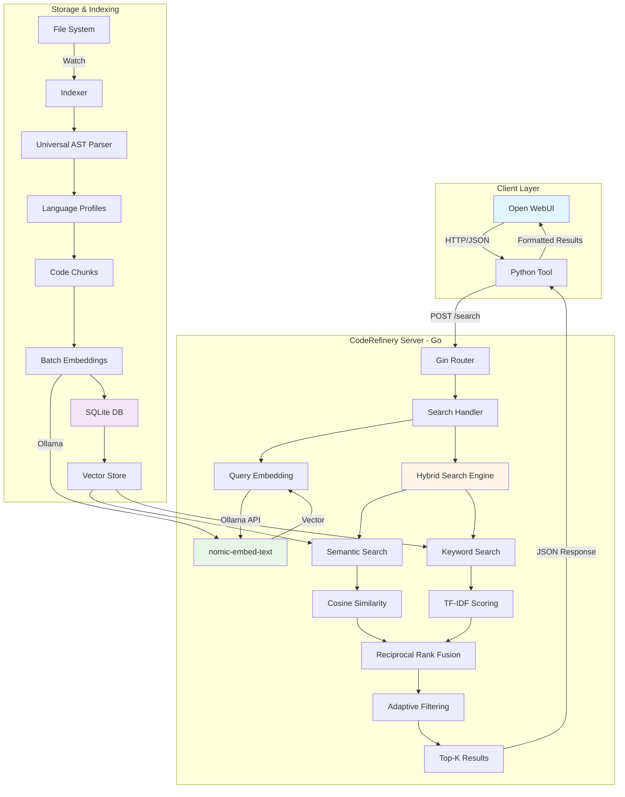
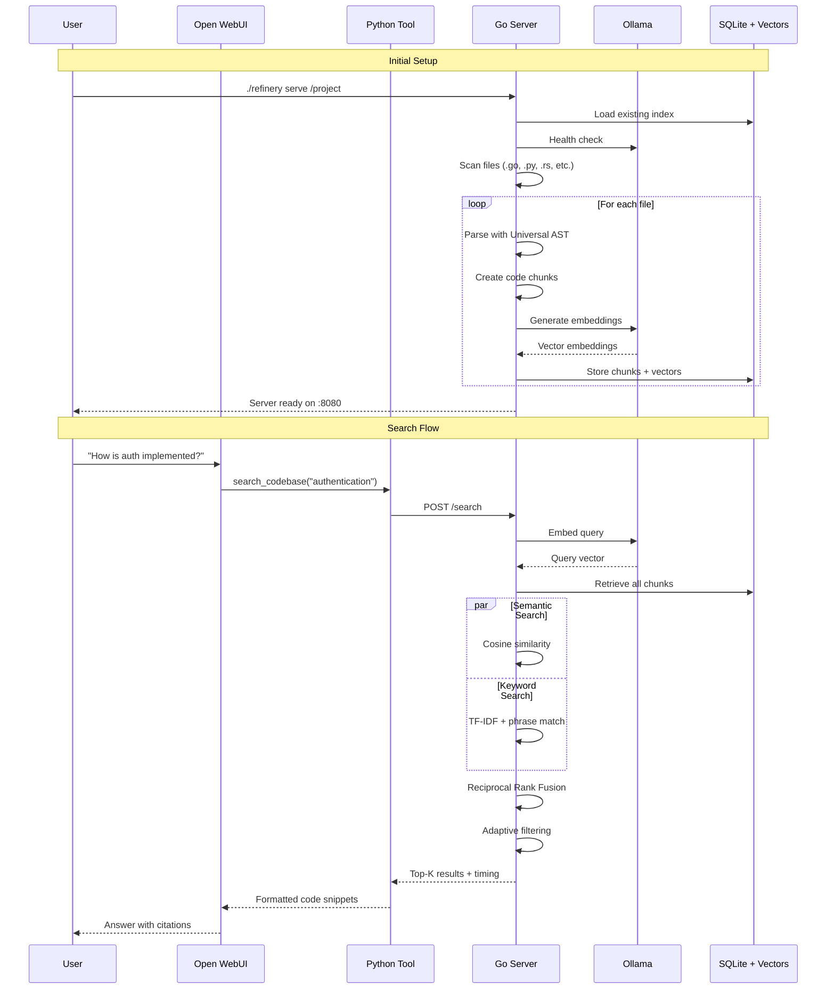

# CodeRefinery - Intelligent Code Search Engine

High-performance RAG system for code analysis with hybrid semantic and keyword search, optimized for 16GB VRAM systems.

## System Architecture



## Data Flow



## Core Components

### 1. Universal AST Parser

Language-agnostic parser supporting 50+ programming languages through intelligent heuristics:

**Supported Language Families:**
- C-Family: C, C++, Rust, Go, Java, C#, JavaScript, TypeScript, Kotlin, Swift, Scala, PHP
- Python-Family: Python (indentation-based)
- Ruby-Family: Ruby, Crystal (begin/end blocks)
- Lisp-Family: Lisp, Scheme, Clojure (S-expressions)
- ML-Family: OCaml, F#, Haskell, Elm (functional)
- Shell: Bash, Zsh, Fish
- Assembly: x86, ARM, MIPS
- SQL: Stored Procedures and Queries
- Lua: Gaming and scripting

**Parsing Strategies:**
- Block-based: Tracks `{}`, `begin/end`, `do/end` delimiters
- Indentation-based: Python, YAML syntax awareness
- Generic: Fallback for unknown languages

### 2. Hybrid Search Engine

**Reciprocal Rank Fusion (RRF):**
```
RRF Score = Σ(1 / (k + rank_i))
```
where k=60 (optimal value from research), combining semantic and keyword rankings.

**Advantages over weighted addition:**
- Scale-invariant (no manual weight tuning)
- Robust against score inflation
- Industry standard (used by Elasticsearch, OpenSearch)

**Keyword Scoring Features:**
- Exact phrase matching (highest priority)
- TF-IDF inspired term weighting
- Stopword filtering (removes "the", "is", "get", etc.)
- Term length weighting (longer = more specific)
- Path and signature boosting

**Semantic Scoring:**
- 768-dimensional embeddings (nomic-embed-text)
- Cosine similarity for relevance
- Context-aware understanding

### 3. Adaptive Result Filtering

Multi-stage filtering for optimal result quality:
1. Hard limit check (user-specified max results)
2. Absolute minimum score threshold
3. Relative quality filter (40% of top score)
4. Elbow detection (50% score drop = thematic break)

## Installation

### Prerequisites

**System Requirements:**
- Go 1.21 or higher
- Ollama running locally
- Open WebUI installed (Docker or native)
- Minimum 4GB free RAM

**Ollama Models:**
```bash
# Embedding model (274MB)
ollama pull nomic-embed-text

# Your main LLM (optional)
ollama pull deepseek-r1:14b
```

### Build Steps

1. Clone and initialize:
```bash
git clone <your-repo>
cd coderefinery
go mod init coderefinery
```

2. Install dependencies:
```bash
go get github.com/gin-gonic/gin
go get github.com/fsnotify/fsnotify
go get github.com/smacker/go-tree-sitter
go get github.com/mattn/go-sqlite3
```

3. Build:
```bash
# Standard build
go build -o refinery cmd/refinery/main.go

# Optimized build (smaller binary)
go build -ldflags="-s -w" -o refinery cmd/refinery/main.go
```

### Project Structure

```
coderefinery/
├── cmd/
│   └── refinery/
│       └── main.go
├── internal/
│   ├── config/
│   │   └── config.go
│   ├── domain/
│   │   └── models.go
│   ├── embedding/
│   │   ├── embedder.go
│   │   └── ollama.go
│   ├── indexer/
│   │   ├── indexer.go
│   │   ├── db.go
│   │   └── parser/
│   │       ├── parser.go
│   │       ├── universal.go
│   │       ├── treesitter.go
│   │       └── go.go
│   ├── search/
│   │   └── searcher.go
│   └── server/
│       ├── server.go
│       └── handlers.go
├── pkg/
│   └── mathutil/
│       └── vector.go
├── go.mod
├── go.sum
└── README.md
```

## Configuration

### Server Configuration

Default configuration in `internal/config/config.go`:

```go
type Config struct {
    Server ServerConfig
    Ollama OllamaConfig
    Indexer IndexerConfig
}

type ServerConfig struct {
    Port           string        // "8080"
    ReadTimeout    time.Duration // 10s
    WriteTimeout   time.Duration // 10s
    MaxRequestSize int64         // 10MB
    EnableCORS     bool          // true
}

type OllamaConfig struct {
    BaseURL string        // "http://localhost:11434"
    Model   string        // "nomic-embed-text"
    Timeout time.Duration // 30s
}

type IndexerConfig struct {
    SupportedExts map[string]string
    ExcludePaths  []string
    MinChunkSize  int           // 50
    MaxChunkSize  int           // 2000
    WatchDebounce time.Duration // 2s
}
```

### Custom Configuration File

Create `config.json`:
```json
{
  "project_path": "/path/to/project",
  "server": {
    "port": "8080"
  },
  "ollama": {
    "base_url": "http://localhost:11434",
    "model": "nomic-embed-text"
  },
  "indexer": {
    "supported_extensions": {
      ".go": "go",
      ".py": "python",
      ".rs": "rust"
    },
    "exclude_paths": [
      "node_modules",
      ".git",
      "vendor"
    ]
  }
}
```

Load with:
```bash
./refinery serve --config config.json /path/to/project
```

## Usage

### Starting the Server

```bash
# Index current directory
./refinery serve

# Index specific project
./refinery serve /path/to/project

# With custom config
./refinery serve --config config.json --port 9000 /path/to/project
```

**Expected Output:**
```
Loading chunks from database...
Loaded 0 chunks from history
Scanning for files (Universal Mode)...
Loaded 15 patterns from .gitignore
Re-indexing 247 files (Dynamic Language Detection)...
Progress: 50/247
Progress: 100/247
...
Indexed 1,847 chunks from 247 files in 18.4s
File watcher enabled
Server running on http://localhost:8080
```

### API Endpoints

**Health Check:**
```bash
curl http://localhost:8080/health
```
Response:
```json
{
  "status": "ok",
  "chunks": 1847,
  "files": 247
}
```

**Statistics:**
```bash
curl http://localhost:8080/stats
```
Response:
```json
{
  "TotalChunks": 1847,
  "TotalFiles": 247,
  "Languages": {
    "go": 1245,
    "python": 312,
    "rust": 290
  },
  "LastIndexed": "2025-01-04T15:23:45Z"
}
```

**Search:**
```bash
curl -X POST http://localhost:8080/search \
  -H "Content-Type: application/json" \
  -d '{
    "query": "database connection pool",
    "limit": 5,
    "min_score": 0.3,
    "languages": ["go"],
    "chunk_types": ["function"]
  }'
```

### Open WebUI Integration

1. Open WebUI Settings → Functions → Add Function

2. Copy Python tool code (see artifacts)

3. Configure Valves:
   - **Docker**: `REFINERY_URL = "http://host.docker.internal:8080"`
   - **Native**: `REFINERY_URL = "http://localhost:8080"`
   - **Linux Docker**: `REFINERY_URL = "http://172.17.0.1:8080"`

4. Enable function and save

5. In chat, enable CodeRefinery tool

### Query Examples

**Basic Search:**
```
"How is user authentication implemented?"
```

**Filtered Search:**
```
"Show me database queries in Go"
```

**Architecture Questions:**
```
"Explain the error handling strategy"
```

**Code Location:**
```
"Where is the JWT token validation?"
```

## Performance Optimization

### VRAM Budget (16GB)

| Component | VRAM Usage |
|-----------|------------|
| CodeRefinery Server | 0 MB (uses RAM) |
| nomic-embed-text | 274 MB |
| DeepSeek-R1 14B | 11.2 GB |
| Context Buffer | ~4 GB |
| **Total** | ~15.5 GB |

### Memory Optimization

**Reduce Chunk Size:**
```go
// internal/config/config.go
IndexerConfig{
    MinChunkSize: 30,   // from 50
    MaxChunkSize: 1500, // from 2000
}
```

**Limit Results:**
```python
# Open WebUI Tool
class Valves:
    DEFAULT_LIMIT = 3  # from 5
    MAX_LIMIT = 10     # from 15
```

**Batch Size Tuning:**
```go
// internal/embedding/ollama.go
maxConcurrency := 3  // from 5 (less memory, slower)
maxConcurrency := 10 // from 5 (more memory, faster)
```

## Advanced Features

### Language Profile Extension

Add custom language support in `internal/indexer/parser/universal.go`:

```go
profiles["your-lang"] = LanguageProfile{
    BlockStart: []string{"begin"},
    BlockEnd:   []string{"end"},
    FunctionPatterns: []*regexp.Regexp{
        regexp.MustCompile(`(?m)^\s*function\s+\w+`),
    },
    LineComment: []string{"//"},
}
```

### Custom Chunk Types

Extend `internal/domain/models.go`:

```go
const (
    ChunkTypeFunction  ChunkType = "function"
    ChunkTypeClass     ChunkType = "class"
    ChunkTypeInterface ChunkType = "interface"
    ChunkTypeStruct    ChunkType = "struct"
    ChunkTypeEnum      ChunkType = "enum"      // NEW
    ChunkTypeConstant  ChunkType = "constant"  // NEW
    ChunkTypeGeneric   ChunkType = "generic"
)
```

### Multi-Repository Support

Extend server to handle multiple codebases:

```go
type RepositoryManager struct {
    indices map[string]*indexer.Indexer
    mu      sync.RWMutex
}

func (rm *RepositoryManager) Search(repo string, query string) []SearchResult {
    rm.mu.RLock()
    idx := rm.indices[repo]
    rm.mu.RUnlock()
    
    return idx.Search(query)
}
```

API Usage:
```bash
curl -X POST http://localhost:8080/search?repo=backend \
  -d '{"query": "authentication"}'
```

### Persistent Embeddings Cache

Store embeddings on disk to speed up restarts:

```go
// internal/indexer/db.go
func (db *DB) SaveEmbeddings() error {
    // Already implemented via SQLite
    return nil
}

func (db *DB) LoadEmbeddings() (map[string][]CodeChunk, error) {
    return db.LoadAllChunks()
}
```

## Troubleshooting

### Server Connection Issues

**Problem:** "Cannot connect to CodeRefinery server"

**Diagnosis:**
```bash
# Check if server is running
ps aux | grep refinery

# Check port availability
netstat -tuln | grep 8080

# Check server logs
./refinery serve  # run in foreground
```

**Solutions:**
1. Start server: `./refinery serve`
2. Check firewall: `sudo ufw allow 8080`
3. Verify URL in Open WebUI tool matches server address

### Indexing Issues

**Problem:** "Indexed 0 chunks"

**Diagnosis:**
```bash
# Check for supported files
find . -name "*.go" -o -name "*.py" -o -name "*.rs" | head -20

# Check excludes
grep -r "node_modules\|.git\|vendor" .gitignore
```

**Solutions:**
1. Add file extensions to config
2. Remove unnecessary excludes
3. Check file permissions: `ls -la`

### Embedding Failures

**Problem:** "Failed to generate embeddings"

**Diagnosis:**
```bash
# Check Ollama status
ollama list

# Test embedding directly
curl http://localhost:11434/api/embeddings \
  -d '{"model":"nomic-embed-text","prompt":"test"}'
```

**Solutions:**
1. Pull model: `ollama pull nomic-embed-text`
2. Restart Ollama: `systemctl restart ollama`
3. Check Ollama logs: `journalctl -u ollama -f`

### Docker Networking

**Problem:** "host.docker.internal" not resolving

**Linux Solution:**
```python
# Use bridge network IP
REFINERY_URL = "http://172.17.0.1:8080"
```

**Alternative:** Use host networking
```bash
docker run --network host open-webui/open-webui
```

### Slow Search Performance

**Problem:** Search takes over 1 second

**Diagnosis:**
- Check chunk count: `curl http://localhost:8080/stats`
- Monitor VRAM: `nvidia-smi`
- Check Ollama response time

**Solutions:**
1. Reduce indexed files (add excludes)
2. Increase batch size for embeddings
3. Use faster embedding model (mxbai-embed-large)
4. Add indexes to SQLite DB

## Best Practices

### Query Design

**Effective Queries:**
- "Show JWT token validation in auth module"
- "How is database connection pooling implemented?"
- "Find error handling in API handlers"

**Ineffective Queries:**
- "Show me code" (too vague)
- "Everything about users" (too broad)
- "Fix this" (no search context)

### Iterative Refinement

Start broad, then narrow:
```
User: "How does logging work?"
      → search_codebase("logging system")

User: "Focus on error logs"
      → search_codebase("error logging implementation")

User: "Show the log rotation logic"
      → search_codebase("log rotation", path_filter="logging/")
```

### Filter Usage

Combine filters for precision:
```json
{
  "query": "database queries",
  "languages": ["go"],
  "path_filter": "internal/db",
  "chunk_types": ["function", "method"]
}
```

### Monitoring

Track system health:
```bash
# Watch VRAM usage
watch -n 1 'nvidia-smi --query-gpu=memory.used --format=csv'

# Monitor search latency
curl -w "@curl-format.txt" -X POST http://localhost:8080/search

# Check index freshness
curl http://localhost:8080/stats | jq '.LastIndexed'
```

## Security Considerations

### Network Security

1. **Firewall Configuration:**
```bash
# Allow only local connections
sudo ufw deny 8080
sudo ufw allow from 127.0.0.1 to any port 8080
```

2. **Reverse Proxy (Production):**
```nginx
server {
    listen 443 ssl;
    server_name coderefinery.internal;
    
    location / {
        proxy_pass http://localhost:8080;
        proxy_set_header Host $host;
    }
}
```

### Data Privacy

- Code embeddings are stored locally in SQLite
- No data sent to external services
- Ollama runs entirely on-premises
- All processing happens in local RAM/VRAM

### Access Control

Implement authentication in production:
```go
// internal/server/middleware.go
func AuthMiddleware() gin.HandlerFunc {
    return func(c *gin.Context) {
        token := c.GetHeader("Authorization")
        if !validateToken(token) {
            c.AbortWithStatus(401)
            return
        }
        c.Next()
    }
}
```

## Contributing

### Development Setup

1. Fork repository
2. Create feature branch: `git checkout -b feature/new-parser`
3. Install development tools:
```bash
go install golang.org/x/tools/cmd/goimports@latest
go install github.com/golangci/golangci-lint/cmd/golangci-lint@latest
```

### Code Style

Run before committing:
```bash
# Format code
gofmt -w .
goimports -w .

# Lint
golangci-lint run

# Test
go test ./...
```

### Adding Language Support

1. Add to `LanguageProfile` in `universal.go`
2. Test with sample code
3. Update documentation
4. Submit PR with examples

## License

MIT License - See LICENSE file for details

## Acknowledgments

- Tree-sitter for AST parsing
- Ollama for local embeddings
- Gin framework for HTTP server
- Open WebUI for LLM interface

## Support

- GitHub Issues: Report bugs and feature requests
- Documentation: This README and inline code comments
- Health endpoint: Monitor server status at `/health`
